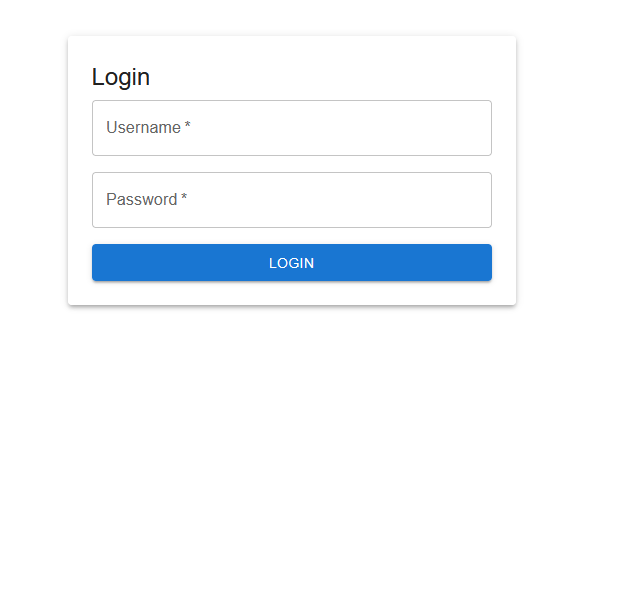

# Split Expenses App

## Overview

The Split Expenses App is a web application designed to help users manage and track shared expenses among friends, family, or groups. It provides a RESTful API for backend operations and a responsive frontend built with TypeScript and React.



## Technologies Used

- **Backend**: Django, PostgreSQL
- **Frontend**: TypeScript, React
- **Containerization**: Docker
- **Web Server**: Nginx
- **Orchestration**: Kubernetes

## Features

- User authentication and management
- Expense creation, tracking, and sharing
- Group management for shared expenses
- RESTful API for seamless integration with the frontend

## Getting Started

### Prerequisites

- Python 3.x
- Node.js and npm
- Docker
- Kubernetes (optional for local development)

### Backend Setup

1. Navigate to the `backend` directory:

   ```
   cd backend
   ```

2. Install the required Python packages:

   ```
   pip install -r requirements.txt
   ```

3. Run database migrations:

   ```
   python manage.py migrate
   ```

4. Start the Django development server:

   ```
   python manage.py runserver
   ```

### Frontend Setup

1. Navigate to the `frontend` directory:

   ```
   cd frontend
   ```

2. Install the required Node packages:

   ```
   npm install
   ```

3. Start the React development server:

   ```
   npm start
   ```

### Deployment

The application can be deployed using Docker and Kubernetes. Refer to the `deploy/README.md` for detailed instructions on building Docker images and deploying to a Kubernetes cluster.

## Observability

The application is designed with observability in mind, incorporating logging and monitoring capabilities to track performance and errors.

## Scalability

Both the backend and frontend components are built to scale horizontally, allowing for increased load handling by adding more instances.

## Optimization

Performance optimizations are implemented in both the backend and frontend, ensuring a smooth user experience.

## Contributing

Contributions are welcome! Please submit a pull request or open an issue for any enhancements or bug fixes.

## License

This project is licensed under the MIT License. See the LICENSE file for more details.
